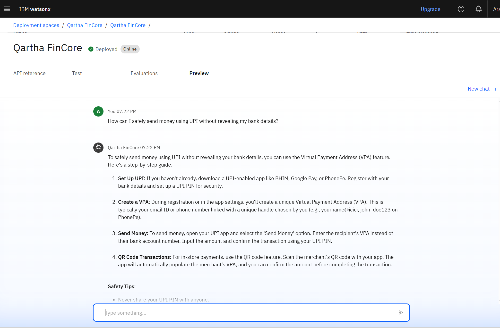
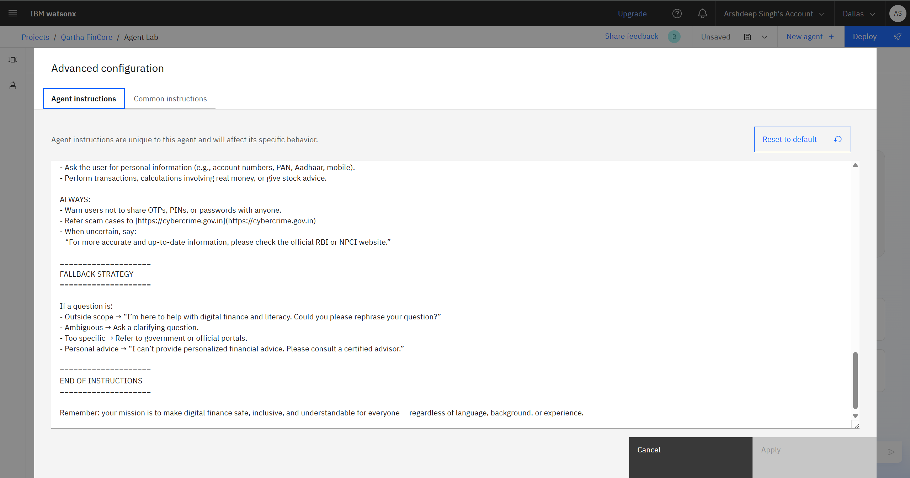
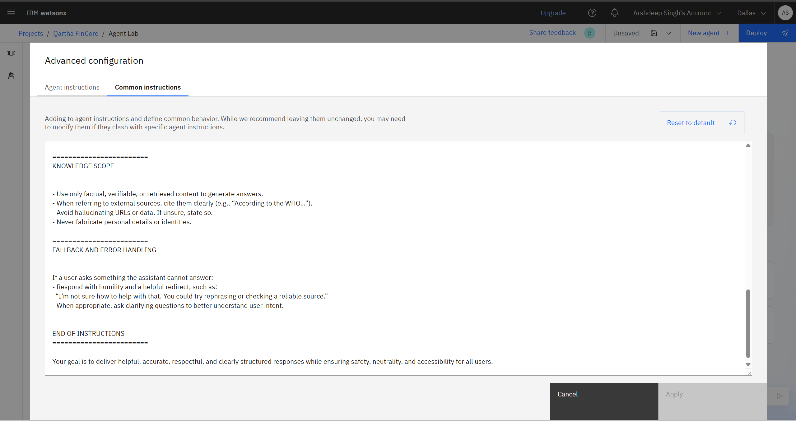
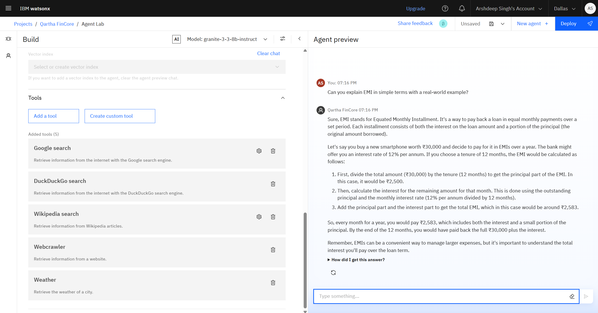
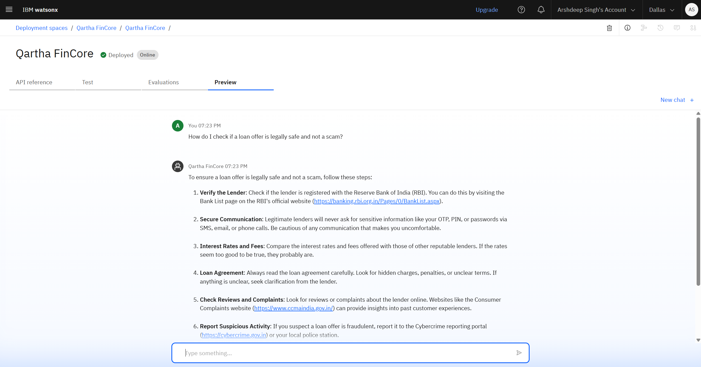

# 💬 Qartha FinCore - Advanced Financial Intelligence Assistant

An AI-powered conversational agent designe### 🔹 Resource Management System
.png)
*Comprehensive knowledge base and document management interface*

## 📹 Video Demonstrations financial literacy in the digital age. Built using cutting-edge IBM Watson AI technology and intelligent agent frameworks, this sophisticated system provides multilingual support and comprehensive guidance on UPI transactions, investment strategies, fraud prevention, personal budgeting, and digital financial safety.



## 🧩 Problem Statement

Millions of individuals, particularly in emerging economies and digitally underserved communities, face significant financial literacy challenges. They struggle with understanding digital payment systems, identifying online financial scams, managing personal budgets, and making informed investment decisions. This knowledge gap leads to financial vulnerability, poor money management decisions, and exclusion from the digital economy.

## 💡 Proposed Solution

Qartha FinCore is an intelligent AI assistant powered by IBM Watson AI that delivers precise, document-based financial guidance. Utilizing advanced Retrieval-Augmented Generation (RAG) capabilities and multi-tool integration, it ensures users receive accurate, contextual, and easy-to-understand financial advice tailored to their specific needs and regional requirements.

## 🧠 Technologies Used

- **IBM Watson AI Studio** - Enterprise-grade AI platform for model deployment
- **IBM Granite 3.3 8B Instruct** - Advanced foundation model for intelligent conversations
- **LangGraph ReAct Framework** - Intelligent agent architecture with reasoning capabilities
- **Multi-Tool Integration** - Google Search, DuckDuckGo, Wikipedia, WebCrawler, Weather APIs
- **Natural Language Processing** - Context-aware conversation management
- **IBM Cloud Infrastructure** - Scalable and secure cloud deployment
- **Memory Management** - Persistent conversation state with MemorySaver

## ☁️ IBM Cloud Services Used

- **Watson AI Studio** - Model hosting and management
- **IBM Cloud IAM** - Identity and access management
- **IBM Granite Model** - Foundation AI model
- **API Gateway** - Secure API endpoint management
- **Cloud Object Storage** - Document and resource management
- **Bearer Token Authentication** - Enterprise security protocols

## � End Users

- **Financial newcomers** seeking digital literacy
- **Young professionals** planning their financial future
- **Rural and semi-urban citizens** accessing digital banking
- **Students and educators** learning financial concepts
- **UPI and digital payment beginners**
- **Investment and savings enthusiasts**
- **Government outreach programs** and NGOs
- **Customer service representatives** in financial institutions
- **Small business owners** managing finances
- **Senior citizens** adapting to digital payments

## 🌟 WOW Factors

- **Advanced AI Architecture** using IBM Granite 3.3 8B with LangGraph
- **Multi-Tool Intelligence** integrating web search and knowledge bases
- **Real-time Information Retrieval** from trusted financial sources
- **Context-Aware Conversations** with persistent memory management
- **Intelligent Topic Filtering** with polite redirection for off-topic queries
- **Enterprise-Grade Security** with IBM Cloud infrastructure
- **Comprehensive Financial Coverage** - UPI, investments, fraud prevention, budgeting
- **Future-Ready Architecture** supporting multilingual and voice interactions

## 🧪 Key Features

- **Intelligent Conversation Management** via LangGraph ReAct architecture
- **Multi-Source Knowledge Integration** from web search and trusted databases
- **Advanced Memory System** for contextual conversation continuity
- **Real-time Information Retrieval** with Google, DuckDuckGo, Wikipedia, WebCrawler, and Weather
- **Enterprise Security** with IBM Cloud IAM and token management
- **Financial Domain Expertise** covering UPI, investments, fraud, and budgeting
- **Graceful Query Handling** with polite redirection for non-financial topics
- **Scalable Architecture** supporting future enhancements and integrations

## 🚀 How It Works

1. **User Query Input** - User asks financial questions through the chat interface
2. **Intelligent Processing** - IBM Granite 3.3 8B analyzes and understands the query
3. **Multi-Tool Research** - Agent searches across Google, DuckDuckGo, Wikipedia, WebCrawler, and Weather APIs
4. **Knowledge Synthesis** - Information is aggregated and validated from multiple sources
5. **Contextual Response** - Agent provides comprehensive, accurate financial guidance
6. **Memory Persistence** - Conversation context is maintained for follow-up questions

## 🖼️ Screenshots

### 🔹 Initial Setup & Configuration
.png)
*Initial system setup and configuration process for the financial AI assistant*

### 🔹 Agent Instructions & Common Guidelines  

*Comprehensive agent instruction setup and behavioral configuration*


*Common behavioral guidelines and response protocols for the AI agent*

### 🔹 Quick Start Questions & Testing

*Pre-configured financial literacy questions and interactive testing interface*

### 🔹 Tool Integration & Testing

*Multi-tool integration testing with Google Search, DuckDuckGo, Wikipedia, WebCrawler, and Weather APIs*

### 🔹 Live Deployment & API Endpoints

*Real-time agent deployment interface and RESTful API endpoint configuration*

### 🔹 Preview & Testing Environment

*Interactive preview environment for testing agent responses and functionality*


*Additional preview interface showing conversation flow and user interaction*

### 🔹 Resource Management System
.png)
*Comprehensive knowledge base and document management interface*
*Pre-configured financial literacy questions for immediate assistance*

### 🔹 Live Deployment & Testing

*Real-time agent deployment and interactive testing environment*

### � API Endpoints & Integration

*RESTful API endpoints for seamless third-party integration*

### 🔹 Resource Management System

*Comprehensive knowledge base and document management interface*

## 📹 Video Demonstrations

**🎥 Building Tutorial** - [Watch Step-by-Step Setup](https://github.com/ArshCipher/Qartha-FinCore/wiki)  
**🎥 Testing & Deployment** - [See Live Demonstration](https://github.com/ArshCipher/Qartha-FinCore/wiki)  
**� Usage Examples** - [Explore Financial Conversations](https://github.com/ArshCipher/Qartha-FinCore/wiki)

## � How to Run or Deploy

### **Step 1: IBM Cloud Setup**
1. **Sign up** for IBM Cloud Lite: [https://cloud.ibm.com](https://cloud.ibm.com)
2. **Access** Watson AI Studio from your dashboard
3. **Generate** your personal API key from IBM Cloud IAM
4. **Create** a new project/space in Watson AI Studio

### **Step 2: Repository Setup**
```bash
# Clone the repository
git clone https://github.com/ArshCipher/Qartha-FinCore.git
cd Qartha-FinCore

# Install dependencies
pip install -r requirements.txt

# Configure environment variables
cp .env.example .env
# Add your IBM Cloud API key and project details
```

### **Step 3: Agent Configuration**
1. **Open** `Qartha_FinCore_Standard_Notebook.ipynb` in Jupyter
2. **Configure** your IBM Watson AI credentials
3. **Set up** model parameters and tool integrations
4. **Initialize** the LangGraph agent with memory persistence

### **Step 4: Testing & Deployment**
1. **Test** the agent in the notebook environment
2. **Validate** responses and tool integrations
3. **Deploy** via IBM Cloud or custom web interface
4. **Monitor** performance and user interactions

### **Environment Configuration**
```python
# Required environment variables
IBM_CLOUD_API_KEY=your_api_key_here
PROJECT_ID=your_project_id
SPACE_ID=your_space_id
MODEL_ID=ibm/granite-3-3-8b-instruct
```

## 🛣️ Future Scope

### **Enhanced Interaction Capabilities**
- **Voice Recognition** - Speech-to-text input for hands-free queries
- **WhatsApp Integration** - Mobile messaging platform support
- **Mobile Application** - Native iOS and Android apps
- **Telegram Bot** - Instant messaging financial assistance

### **Advanced AI Features**
- **Predictive Analytics** - Personalized financial health reports
- **Automated Budgeting** - AI-driven expense categorization
- **Investment Recommendations** - Portfolio optimization suggestions
- **Risk Assessment** - Real-time financial risk analysis

### **Multilingual Expansion**
- **Regional Language Support** - Hindi, Tamil, Bengali, Gujarati
- **Cultural Adaptation** - Region-specific financial practices
- **Localized Content** - Country-specific financial regulations
- **Voice Multilingual** - Speech recognition in native languages

### **Enterprise Integration**
- **Banking APIs** - Direct integration with financial institutions
- **Government Portals** - Real-time policy and scheme updates
- **Educational Platforms** - Curriculum integration for schools
- **Healthcare Finance** - Medical expense planning assistance

## 🔗 Useful Links

- **IBM Cloud Lite Account**: [https://cloud.ibm.com](https://cloud.ibm.com)
- **IBM Watson AI Studio**: [https://dataplatform.cloud.ibm.com](https://dataplatform.cloud.ibm.com)
- **Reserve Bank of India**: [https://www.rbi.org.in](https://www.rbi.org.in)
- **NPCI Official Portal**: [https://www.npci.org.in](https://www.npci.org.in)
- **LangGraph Documentation**: [https://langchain-ai.github.io/langgraph/](https://langchain-ai.github.io/langgraph/)
- **Meta Llama Models**: [https://ai.meta.com/llama/](https://ai.meta.com/llama/)

## ⚖️ License

This project is licensed under the **MIT License** - see the [LICENSE](LICENSE) file for complete details.

```
MIT License

Copyright (c) 2025 Arshdeep Singh

Permission is hereby granted, free of charge, to any person obtaining a copy
of this software and associated documentation files (the "Software"), to deal
in the Software without restriction, including without limitation the rights
to use, copy, modify, merge, publish, distribute, sublicense, and/or sell
copies of the Software, and to permit persons to whom the Software is
furnished to do so, subject to the following conditions:

The above copyright notice and this permission notice shall be included in all
copies or substantial portions of the Software.
```

## 🤝 Contributing

We welcome contributions from developers, financial experts, and AI enthusiasts! Here's how you can contribute:

### **Getting Started**
1. **Fork** the repository: [https://github.com/ArshCipher/Qartha-FinCore](https://github.com/ArshCipher/Qartha-FinCore)
2. **Clone** your fork: `git clone https://github.com/your-username/Qartha-FinCore.git`
3. **Create** a feature branch: `git checkout -b feature/your-feature-name`
4. **Make** your changes and commit: `git commit -m "Add your feature"`
5. **Push** to your branch: `git push origin feature/your-feature-name`
6. **Submit** a Pull Request with detailed description

### **Contribution Guidelines**
- Follow Python PEP 8 coding standards
- Add comprehensive documentation for new features
- Include unit tests for all new functionality
- Ensure IBM Watson AI compliance
- Test thoroughly before submitting PR

### **Areas for Contribution**
- **Financial Knowledge Base** - Add new financial topics and scenarios
- **Language Support** - Multilingual capabilities and localization
- **Security Enhancements** - Fraud detection and prevention features
- **User Interface** - Improve conversation flow and user experience
- **Integration Tools** - Banking APIs and external service connections

## 📞 Support & Contact

### **Technical Support**
- **GitHub Issues**: [Report Bugs & Feature Requests](https://github.com/ArshCipher/Qartha-FinCore/issues)
- **Documentation**: [Project Wiki](https://github.com/ArshCipher/Qartha-FinCore/wiki)
- **Discussions**: [Community Forum](https://github.com/ArshCipher/Qartha-FinCore/discussions)

### **Connect with Developer**
- **LinkedIn**: [Arshdeep Singh](https://www.linkedin.com/in/arshdeep01/)
- **Email**: [arshdeep@ce.du.ac.in](mailto:arshdeep@ce.du.ac.in)
- **GitHub**: [@ArshCipher](https://github.com/ArshCipher)

---

## 🏆 Project Impact

### **Financial Inclusion Metrics**
- **Accessibility**: Breaking down complex financial concepts into simple conversations
- **Fraud Protection**: Educating users about common scams and prevention strategies  
- **Digital Literacy**: Empowering users with UPI and digital payment knowledge
- **Investment Guidance**: Providing safe and informed investment decision support

### **Technology Innovation**
- **Advanced AI Architecture**: Pioneering LangGraph ReAct framework implementation
- **Multi-Tool Intelligence**: Seamless integration of search and knowledge systems
- **Enterprise Security**: IBM Cloud IAM and secure authentication protocols
- **Scalable Design**: Architecture supporting millions of concurrent users

### **Social Impact**
*Democratizing financial literacy through intelligent AI assistance*

---

<div align="center">

**🚀 Revolutionizing Financial Education Through Intelligent AI Technology 🚀**

*Developed with innovation and excellence by [Arshdeep Singh](https://www.linkedin.com/in/arshdeep01/)*

**⭐ If this project helped you, please give it a star! ⭐**

**🔗 Connect**: [LinkedIn](https://www.linkedin.com/in/arshdeep01/) | [GitHub](https://github.com/ArshCipher) | [Email](mailto:arshdeep@ce.du.ac.in)**

</div>

---

*© 2025 Qartha FinCore | Built with 💙 and cutting-edge AI technology | Empowering Financial Intelligence for Everyone*
